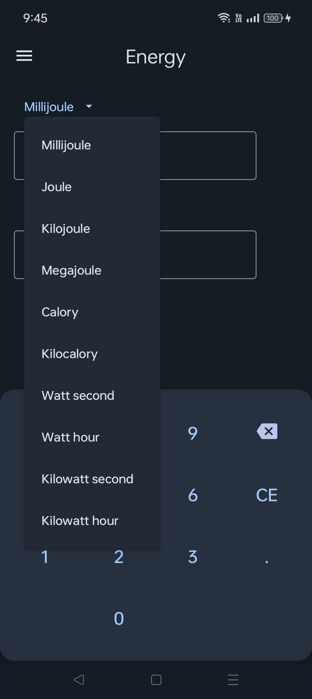

 

## Calculator Plus

# About

The main objective of this project is to develop all in one calculator. 
So it contains various types of calculators, converters, tools and more. 
This project uses Kotlin is used as primary programming language, Android studio.
Jetpack Compose is Android’s recommended modern toolkit for building native UI. 
It simplifies and accelerates UI development on Android. 
Material 3 includes updated theming, components and Material You personalization features like dynamic color, and is designed to be cohesive with the new visual style and system UI on Android 12 and above.

# Features

The android app lets you:

- Calculator
- 20 + Converters

### Coverters

1. Length
2. Angle
3. Area
4. CSS Units
5. Current
6. Energy
7. Data
8. Electric charge
9. Mass
10. Pressure
11. Spped
12. Volume
13. Voltage
14. Work
15. Blood glucose
16. Acceleration
17. Torque
18. Luminous flux
19. Luminous
20. Force

# Screenshots

